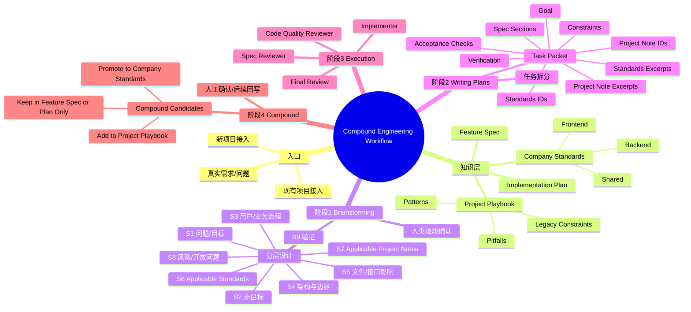
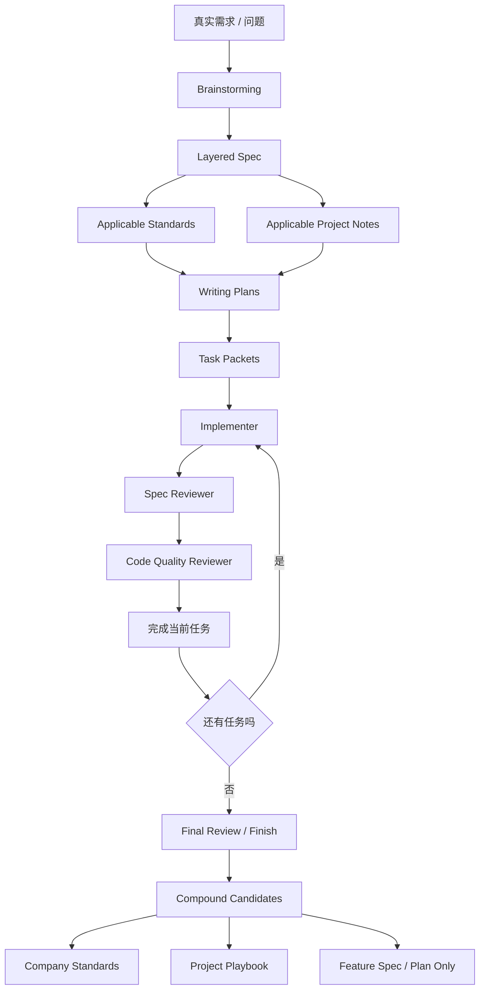
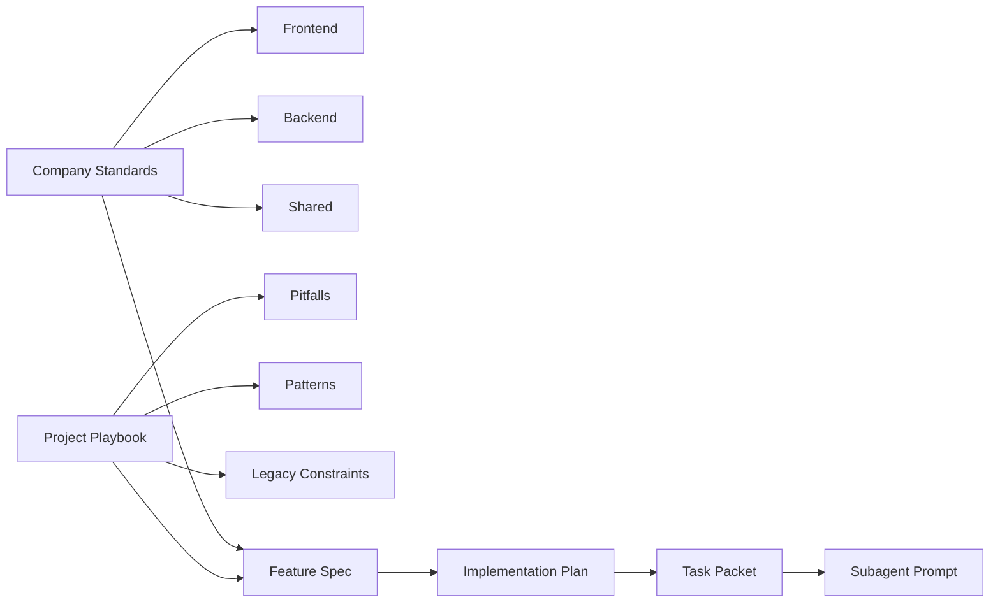
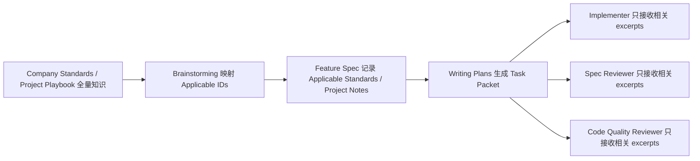
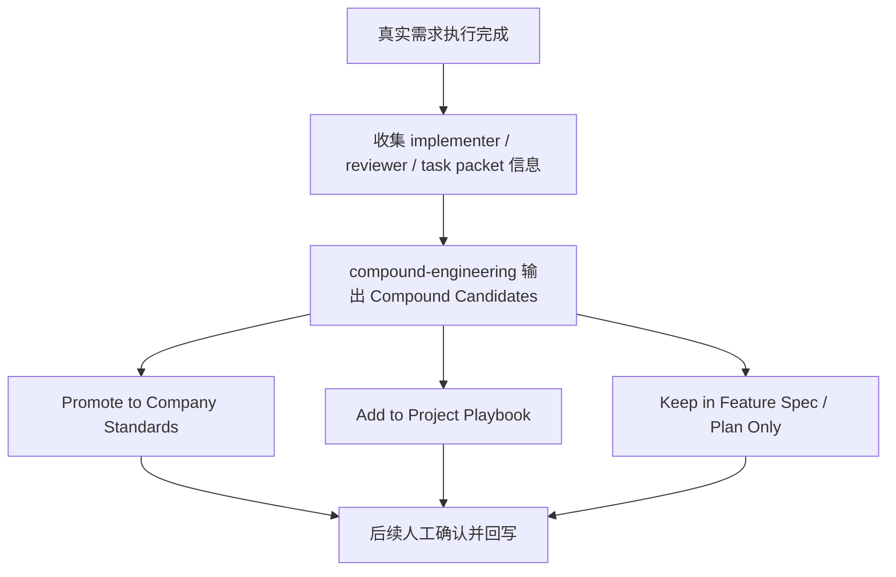
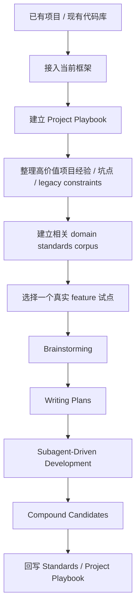
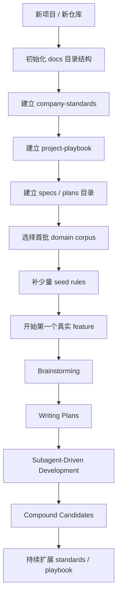

# Compound Engineering Workflow Mindmap

这份文档用来说明当前框架的三件事：
1. 整个流程是如何运转的
2. spec 是如何做到渐进式披露的
3. compound 是如何自动产出候选沉淀项的

---

## 1. 整体思维导图

---

## 1.1 GitHub 展示版总流程图

---

## 1.2 GitHub 展示版知识分层图

---

## 2. 整体流程说明

### Step 1：Brainstorming
目标：把模糊需求变成可执行的设计。

这一阶段会做：
- 先理解需求与约束
- 分层输出设计
- 标记 `Applicable Standards`
- 标记 `Applicable Project Notes`
- 逐段让人类确认

输出物：
- `docs/superpowers/specs/...`
- 一份 layered spec

### Step 2：Writing Plans
目标：把设计变成可执行任务。

这一阶段会做：
- 按任务拆分 implementation plan
- 为每个任务生成 task packet
- 只绑定当前任务需要的 standards / project notes

输出物：
- `docs/superpowers/plans/...`
- 每个任务的 compact execution packet

### Step 3：Execution
目标：让 subagent 在受控上下文下实施任务。

执行顺序：
1. implementer 拿任务包实施
2. spec reviewer 检查：是否满足 task + standards + project notes
3. code-quality reviewer 检查：是否以干净方式实现
4. 通过后进入下一任务
5. 最后做全局收尾

### Step 4：Compound
目标：把这次真实工作中的经验转化为可复用知识。

这一阶段不会直接把所有经验写回，而是先自动产出候选分类：
- `Promote to Company Standards`
- `Add to Project Playbook`
- `Keep in Feature Spec / Plan Only`

这一步让框架具备“复利”能力：
每次完成真实工作后，都能判断知识应沉淀到哪一层。

---

## 3. Spec 是如何渐进式披露的

当前框架的渐进式披露分成两条线：
- **对人类的披露**
- **对 agent 的披露**

### 3.1 对人类的渐进式披露

在 `brainstorming` 阶段，设计不会一次性全部倒出来，而是按层展开：

1. 先讲问题和目标
2. 再讲非目标和边界
3. 再讲用户/业务流程
4. 再讲架构与文件影响
5. 最后才映射 standards / project notes / verification

另外：
- standards 默认先展示 **ID + 一句话摘要**
- project notes 默认先展示 **ID + 一句话摘要**
- 只有需要时才展开全文

这意味着：
- 用户不会一开始就被完整 standards corpus 压住
- spec 的信息密度是按理解需要逐层增加的

### 3.2 对 agent 的渐进式披露

对 agent 不是“整库注入”，而是“按任务切片注入”。

也就是：
- controller 会读完整 spec / plan
- controller 会按 stable IDs 找到相关 rule / note cards，并把 exact excerpts 复制进 task packet
- 但 implementer / reviewer 只拿到当前任务需要的部分
- 当前框架默认没有隐藏的 runtime parser 让 subagent 自己去 resolve IDs 或扫描整库

#### task packet 里会携带
- Goal
- Spec Sections
- Applicable Standards
- Standards Excerpts
- Applicable Project Notes
- Project Note Excerpts
- Constraints / Non-goals
- Acceptance Checks

#### subagent 拿到的不是
- 整个 `docs/company-standards/`
- 整个 `docs/project-playbook/`
- 整份 feature spec 的所有细节
- 一个“自己去找所有相关规则”的开放式检索任务

而是：
- 当前任务相关的摘录
- 当前任务相关的边界
- 当前任务相关的验证要求

### 3.3 渐进式披露的核心机制

核心思想：
- **人类** 看到的是逐段设计 + 映射摘要
- **agent** 看到的是按任务切片后的最小必要上下文

这样做的结果是：
- 降低上下文污染
- 提高子代理聚焦度
- 减少 standards 被机械过度套用

---

## 4. 自动 compound 是如何做到的

### 4.1 “自动”的真实含义

当前 v1 的“自动 compound”不是指：
- 自动直接修改 standards
- 自动直接改写 playbook

而是指：
- 在 workflow 结束时，框架会**自动要求产出 compound candidates**
- 自动把这次工作中得到的经验，分类到合适的知识层

所以它是：
- **自动识别与输出候选项**
- **人工确认 / 后续任务回写**

这是一个“自动产出候选，人工确认沉淀”的模式。

### 4.2 自动 compound 依赖的基础结构

之所以能自动 compound，是因为前面几层已经标准化：

1. **standards 有稳定 ID**
2. **project notes 有稳定 ID**
3. **稳定 ID 绑定的是 card，不是文件名**
4. **corpus 用 `README.md` / `index.md` 作为锚点，topic 文件可按需要扩展**
5. **feature spec 有 Applicable 映射**
6. **plan 有 task packets**
7. **execution 有 spec review + code-quality review**

这让系统在收尾时可以判断：
- 这是通用规则吗？
- 这是当前项目经验吗？
- 这是一次性 feature 决策吗？

### 4.3 自动 compound 的分类逻辑

#### A. Promote to Company Standards
适合：
- 跨项目适用
- 可长期复用
- 属于公司级工程规则

例如：
- 一个新的 backend service boundary 规则
- 一个新的 shared testing 原则

#### B. Add to Project Playbook
适合：
- 只在当前仓库成立
- 属于项目坑点 / legacy / vendor quirks
- 离开这个项目就不一定成立

例如：
- 某个 SDK 初始化顺序不能动
- 某个旧表格组件必须保持 stable identity

#### C. Keep in Feature Spec / Plan Only
适合：
- 只对当前 feature 有意义
- 生命周期短
- 不值得长期沉淀

例如：
- 本次只做 A，不做 B
- 本次 rollout 先兼容旧字段

### 4.4 自动 compound 的流程图

### 4.5 多人维护时为什么稳定 ID 仍然成立

- 规则 / note 的主身份是 stable ID，不是文件名
- 一个 topic 文件可以包含多条 card，因此文档重组不必破坏引用
- 日常维护优先 additive edits，不为“编号更整齐”而 renumber
- 并发新增时，如果撞号，merge 时选择下一个可用 ID 即可；必要时团队可自行约定号段

### 4.6 为什么这是“复利”

因为这套框架不是只完成一次任务，而是在每次任务完成后都多做一步：

- 这次学到了什么？
- 这次踩到了什么坑？
- 这次总结出的模式属于哪一层？

所以：
- standards 会越用越强
- project playbook 会越用越贴合项目现实
- 后续的 spec / plan / subagent 执行质量会继续提升

这就是 compound engineering 的核心：
**通过标准化分层知识，把一次次真实工作转化为长期可复用资产。**

---

## 4.7 GitHub 展示版：为什么这个框架比普通文档体系更强

普通文档体系的问题是：
- 文档写完后很容易脱离实际执行
- agent 不一定会读到真正 relevant 的内容
- 项目经验经常停留在人的脑子里

当前框架解决这几个问题的方式是：
- standards / playbook 被结构化成可引用知识
- feature spec 映射 applicable IDs
- plan 把这些 ID 变成 task packet
- subagent 只拿相关 excerpt
- compound step 再把真实工作的经验回流成下一轮可复用资产

所以它不是：
- “写更多文档”

而是：
- “让知识真正进入执行闭环”

---

## 4.8 现有项目接入流程图

### 现有项目接入的关键点
- 不要一上来全量迁移所有文档
- 先整理最常踩坑的 project notes
- 先补最常用的 standards
- 先用一个真实 feature 验证整条链路
- 通过 compound 逐步反哺知识库，而不是一次性设计完所有规则

---

## 4.9 新项目初始化流程图

### 新项目初始化的关键点
- 先把目录结构搭起来
- 不需要一开始就补全全部规则
- 只需要少量 seed rules 就可以启动
- project playbook 从第一天就应该存在
- 从第一个 feature 开始就走统一 workflow

---

## 4.10 角色视角：每一类参与者看到什么

### A. 人类 / 使用者视角
人类在这套流程里看到的是：
- 分层设计，而不是一次性灌入全部信息
- standards / project notes 的摘要映射，而不是整库全文
- task packet 驱动的计划，而不是只有模糊任务标题
- compound candidates，而不是做完就结束

换句话说，人类负责：
- 决策
- 边界确认
- 复利沉淀的最后判断

### B. Implementer Subagent 视角
implementer 默认拿到的是一个受控 task packet：
- full task text
- goal
- spec sections
- applicable standards
- standards excerpts
- applicable project notes
- project note excerpts
- constraints / non-goals
- acceptance checks

implementer 默认**拿不到**：
- 整个 standards corpus
- 整个 project playbook
- 整份 spec 的所有细节

因此 implementer 的职责是：
- 在最小必要上下文下实现任务
- 按约束做事，而不是自由发挥
- 如果 standards / project notes 与任务冲突，就先提问

### C. Spec Reviewer 视角
spec reviewer 看到的是：
- 当前任务要求
- 当前任务绑定的 standards / project notes excerpts
- implementer 声称完成了什么
- 实际代码

spec reviewer 的核心职责不是评价“写得漂不漂亮”，而是先判断：
- 任务要求是否真的满足
- required standards 是否满足
- recommended standards 是否被合理处理
- project pitfalls / legacy constraints 是否被忽略

### D. Code Quality Reviewer 视角
code-quality reviewer 看到的是：
- 当前任务摘要
- 相关变更
- 当前任务的 standards / project-note 约束背景

它的职责是：
- 检查实现是否干净
- 检查边界是否清晰
- 检查是否虽然“形式合规”，但实际上引入了多余复杂度

也就是说：
- spec reviewer 关注“做没做对”
- code-quality reviewer 关注“是不是以好的方式做对”

### E. Compound 视角
compound step 看到的是：
- 本次 feature 的设计与边界
- 本次计划中的 task packets
- implementer / reviewer 在执行中暴露出的经验
- 本次工作最终留下的可复用信息

compound step 的职责是自动输出候选沉淀项：
- Promote to Company Standards
- Add to Project Playbook
- Keep in Feature Spec / Plan Only

因此它不是直接改文档，而是：
- 自动做知识分层判断
- 把候选沉淀项交给人类确认或后续任务回写

---

## 5. 一句话总结

当前框架的本质是：

- 用 **layered spec** 做人类侧渐进披露
- 用 **task packet** 做 agent 侧渐进披露
- 用 **compound step** 自动输出知识沉淀候选

所以它不是单纯的文档体系，而是：
**一个让知识进入 agent workflow、再从 workflow 反哺知识库的闭环系统。**
