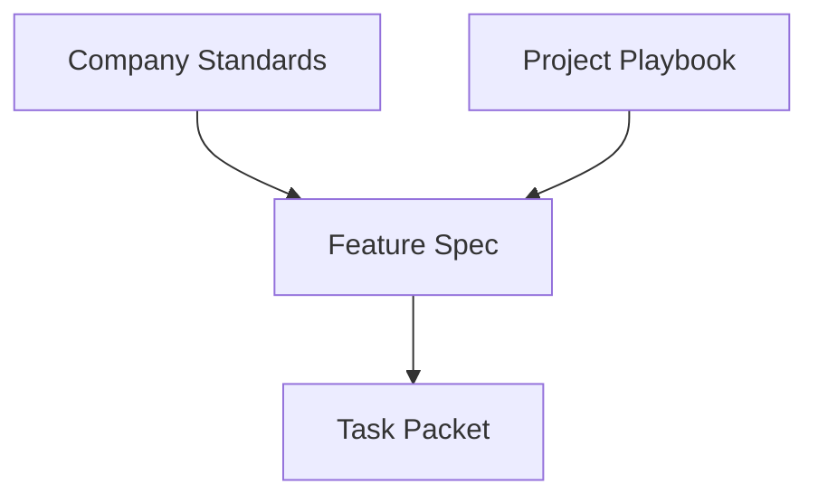

# Compound Engineering Workflow TL;DR

这是一份给团队第一次接触当前框架时使用的一页纸说明。

---

## 这套框架解决什么问题

它解决的不是“怎么多写文档”，而是：
- 怎么让 agent 在写代码前先把设计想清楚
- 怎么让长期规范真正进入执行过程
- 怎么让项目经验不只停留在人的脑子里
- 怎么让每次真实工作都沉淀成下一次更好用的知识

一句话：

> 这是一个让 **设计、执行、评审、知识沉淀** 连成闭环的工程工作流框架。

---

## 整个流程只有 4 步


### 1. Brainstorming
先讨论需求，不直接写代码。

输出：
- layered spec
- Applicable Standards
- Applicable Project Notes

### 2. Writing Plans
把设计拆成一组可执行任务。

输出：
- task packets
- 每个任务绑定 relevant standards / project notes excerpts

### 3. Execution
subagent 按任务包执行。

顺序：
- implementer
- spec reviewer
- code-quality reviewer

### 4. Compound
工作做完后，不直接结束，而是输出：
- 哪些经验应进入 company standards
- 哪些经验应进入 project playbook
- 哪些经验只留在当前 feature

---

## 这套框架的 4 层知识



### 1. Company Standards
公司级长期规则。

例如：
- frontend 组件/hook/testing 规则
- backend API/service/data/testing 规则
- shared testing/security/architecture 规则

### 2. Project Playbook
当前项目自己的经验、坑点、legacy constraints。

### 3. Feature Spec
当前需求的设计文档。

### 4. Task Packet
当前任务真正执行时给 subagent 的最小上下文包。

---

## corpus 组织原则

- `README.md` / `index.md` 是各 corpus / domain 的稳定锚点
- `components.md` / `hooks.md` / `pitfalls.md` 这类只是推荐分组，不是硬编码白名单
- 稳定 ID 绑定的是 rule / note card，不是文件名
- 一个 topic 文件里可以放多条 card，不要求 one-file-per-rule
- 多人维护时优先追加，不为编号整齐而 renumber

---

## 渐进式披露是怎么做的

核心原则：

> **人类看摘要和分层；agent 看任务切片和相关摘录。**

### 对人类
在 brainstorming 阶段：
- 设计按层展示
- standards / project notes 先显示 ID + 一句话摘要
- 需要时才展开全文

### 对 agent
在 execution 阶段：
- implementer / reviewer 不拿整库
- 只拿当前任务相关：
  - spec sections
  - standards excerpts（如果可用）
  - project note excerpts（如果可用）
  - constraints
  - acceptance checks
- 这些 excerpts 是在 plan / task packet 阶段按 stable ID 复制进去的；如果 corpus 还没初始化，就不应凭空虚构 excerpt，更不是靠 subagent 运行时自己去解析整库

这就是渐进式披露：
- 不一次性灌全部信息
- 只在当前步骤暴露当前需要的知识
- 当前框架默认没有隐藏的 runtime parser 自动按 ID 切 markdown

---

## “自动 compound” 到底自动了什么

不是自动改文档。

当前 v1 的自动 compound 是：
- workflow 收尾时自动要求输出 `Compound Candidates`
- 自动把这次工作中的经验做初步分类

分类结果只有三类：
- **Promote to Company Standards**
- **Add to Project Playbook**
- **Keep in Feature Spec / Plan Only**

也就是说：
- 自动做候选识别
- 人工确认后再沉淀

---

## 现有项目怎么接入

最小做法：

1. 建 `docs/project-playbook/`
2. 建相关的 `docs/company-standards/<domain>/`
3. 选一个真实 feature 试跑完整流程
4. 用 compound 结果回写知识库

不要一上来就试图补完整个体系。

---

## 新项目怎么接入

最小结构：

```text
docs/company-standards/
  frontend/
  backend/
  shared/

docs/project-playbook/
docs/superpowers/specs/
docs/superpowers/plans/
```

然后：
- 先补少量 初始规则内容
- 从第一个 feature 开始走完整 workflow

---

## 一句话记住这套框架

> 用 layered spec 做人类侧渐进披露，用 task packet 做 agent 侧渐进披露，用 compound step 把真实工作转化为长期可复用知识。
