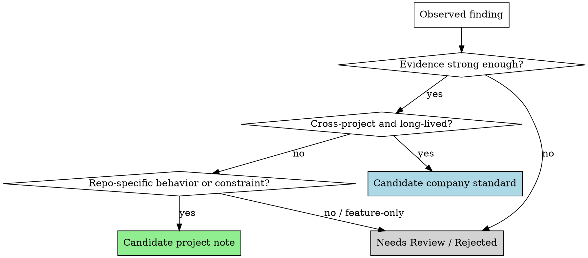

# Bootstrapping Project Knowledge

## Overview

Use this skill to cold-start the framework on an existing codebase.

The goal is not to dump vague best practices into repo docs. The goal is to scan the project, extract high-signal engineering knowledge, and sort each finding into the right long-lived corpus:
- `docs/company-standards/` for reusable organization-level rules
- `docs/project-playbook/` for repo-specific pitfalls, patterns, and legacy constraints

Default behavior: **produce candidates first, then wait for confirmation before writing corpus files.**

## When to Use

Use this when:
- a team wants to adopt this workflow in an existing repository
- `company-standards` and `project-playbook` are missing, thin, or outdated
- the user asks you to analyze an existing project and fill in standards / playbook content
- you need to turn repeated repo evidence into stable IDs that later specs and plans can cite

Do not use this when:
- the work is only about one feature
- the user already knows the exact rule/note to add
- there is not enough code or documentation to infer durable patterns

## Required Inputs

Before proposing any candidate, inspect high-signal evidence such as:
- root `README` and docs
- test structure and repeated test patterns
- lint / typecheck / build / CI configuration
- representative source directories
- repeated reviewer guardrails in docs or prompts

Every candidate must cite evidence.

## Classification Flow

## Classification Rules

### Candidate Company Standards

Put a finding in `docs/company-standards/` only if it is:
- reusable across multiple features or projects
- stable enough to remain useful over time
- broader than one repository quirk or one migration
- specific enough to review and cite by ID

Then choose the right ID family:
- `FE-*` for frontend
- `BE-*` for backend
- `SH-*` for shared cross-domain rules

### Candidate Project Playbook Notes

Put a finding in `docs/project-playbook/` only if it is tied to this repository, such as:
- integration-specific traps
- local patterns proven useful in this codebase
- legacy constraints
- vendor or architecture quirks that do not generalize cleanly

Then choose the right ID family:
- `PRJ-PIT-*` for pitfalls
- `PRJ-PAT-*` for patterns
- `PRJ-LEG-*` for legacy constraints

### Needs Review / Rejected

Use this bucket when:
- evidence is too thin
- the finding is only feature-specific
- the rule is just a generic platitude
- two possible destinations are plausible and the distinction matters

Do not force weak findings into a corpus.

## Evidence Standard

A candidate is not valid unless it includes:
- at least one concrete file path
- a short evidence summary
- why the evidence implies a durable rule or note
- why it belongs in standards vs project playbook

Stronger signals include:
- repeated patterns in multiple files
- explicit repo docs or contributor guidance
- repeated tests that encode the same expectation
- CI / config rules that shape normal engineering behavior

Weak signals include:
- one-off implementation choices
- personal style preferences from a single file
- speculative “best practices” without repo evidence

## Output Format

First produce a bootstrap report, typically at:
- `docs/superpowers/specs/YYYY-MM-DD-project-knowledge-bootstrap.md`

Recommended sections:
1. `Project Signals / Inventory`
2. `Candidate Company Standards`
3. `Candidate Project Playbook Notes`
4. `Needs Review / Rejected`
5. `Proposed Next Writes`

For each candidate, include:
- proposed title
- proposed ID family
- destination corpus
- applies when
- evidence paths
- why this belongs here
- draft card fields needed by the target corpus

## Confirmation Gate

Default workflow:
1. scan project evidence
2. produce candidate report
3. ask for confirmation
4. only then write or update corpus files and indexes

Do **not** write directly into `docs/company-standards/` or `docs/project-playbook/` by default.

If the user explicitly wants direct writes, still keep the evidence and classification visible before making changes.

## Guardrails

Never:
- invent rules without evidence
- promote repo quirks into company standards
- hide uncertainty by writing generic advice
- duplicate near-identical IDs instead of merging with an existing rule or note
- convert short-lived feature decisions into long-lived corpus content

Prefer fewer high-confidence candidates over many weak ones.

## Integration With The Framework

The output of this skill should feed the rest of the workflow:
- `brainstorming` maps future work to these IDs
- `writing-plans` copies only relevant IDs and excerpts into task packets
- `subagent-driven-development` passes only relevant excerpts to implementer and reviewer subagents
- `compound-engineering` can later promote new lessons or keep them repo-local

## Suggested Prompting Pattern

A good request for this skill looks like:

> Analyze this existing project and propose candidate `company-standards` and `project-playbook` entries. Classify each one, show evidence, and wait for confirmation before writing corpus files.
