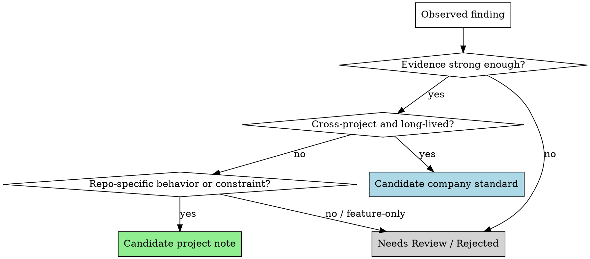

# Bootstrapping Project Knowledge

## Overview

Use this skill to cold-start the framework on an existing codebase.

The goal is not to dump vague best practices into repo docs. The goal is to scan the project, extract high-signal engineering knowledge, and sort each finding into the right long-lived corpus:
- `docs/company-standards/` for reusable organization-level rules
- `docs/project-playbook/` for repo-specific pitfalls, patterns, and legacy constraints

Default behavior: **produce candidates first, then wait for confirmation before writing corpus files.**

## Output Language

Follow the user's language when writing the bootstrap report and candidate content.
- If the user is writing in Chinese, write the report in Chinese.
- If the user is writing in English, write the report in English.
- Keep IDs, file paths, and code blocks unchanged.
- If the repository already has a dominant documentation language, match the user's language first and only keep stable repo terms in their existing form when needed for clarity.

## When to Use

Use this when:
- a team wants to adopt this workflow in an existing repository
- `company-standards` and `project-playbook` are missing, thin, or outdated
- the user asks you to analyze an existing project and fill in standards / playbook content
- you need to turn repeated repo evidence into stable IDs that later specs and plans can cite

Do not use this when:
- the work is only about one feature
- the user already knows the exact rule/note to add
- there is not enough code or documentation to infer durable patterns

## Required Inputs

Before proposing any candidate, inspect high-signal evidence such as:
- root `README` and docs
- test structure and repeated test patterns
- lint / typecheck / build / CI configuration
- representative source directories
- repeated reviewer guardrails in docs or prompts

Every candidate must cite evidence.

## Corpus Discovery and Template Suite Flow

Before bootstrapping, inspect whether the project already has these corpus directories:
- `docs/company-standards/`
- `docs/project-playbook/`

Treat the two corpora independently.

### If a corpus already exists

Treat that corpus as user-maintained structure.

This is a hard rule that overrides the generic “topic files are flexible groupings” guidance elsewhere in the framework.

Treat that corpus as user-maintained structure:
- only analyze and fill `.md` files that already exist inside that corpus
- do **not** privately add any new `[topic].md`
- do **not** silently create missing anchor files
- do **not** create or propose any other new topic file in that corpus under any circumstance
- if a finding does not fit any existing `.md` file, skip it entirely
- do **not** propose a new topic file for that finding, even in the bootstrap report
- do **not** ask to create a new topic file for that finding later

In this mode, the skill should adapt to the user's existing topic grouping instead of re-imposing default starter files.

### If a corpus is missing

This is also a hard rule: do **not** scaffold an empty corpus directory tree on your own.

Tell the user which corpus directory is missing, then:
1. show the available built-in template suites under `skills/bootstrapping-project-knowledge/template-suites/<corpus>/`
2. let the user choose a suite
3. ask whether to:
   - copy/install the suite only
   - copy/install the suite and then analyze/fill the suite's `[topic].md` files

If the user declines analysis/filling, only copy the selected suite into the project and stop.

If the user approves analysis/filling, only analyze/fill files that come from the selected suite. Do **not** add extra topic files beyond the chosen suite.

Do **not** replace this flow with “create empty folders first” or “create a minimal scaffold first.” The built-in template suite selection step comes first.

When explaining this branch, explicitly say that the user chooses a built-in template suite before any copying, scaffolding, analysis, or filling happens.

### Mixed corpus state

If one corpus already exists and the other is missing:
- existing side: only fill existing files
- missing side: follow the suite-selection flow

### Examples

- Existing corpus + no matching existing topic file → skip the finding entirely.
- Existing corpus + matching existing topic file → keep the candidate tied to that existing file only.
- Missing corpus + user selects a built-in suite + install-only → copy that suite and stop.
- Missing corpus + user selects a built-in suite + install-and-analyze → limit all proposed writes to files from that suite.

### Quick Answers

- If the corpus already exists and no existing `.md` file fits, should Claude create or propose a new topic file? **No.**
- If the corpus already exists and no existing `.md` file fits, should Claude skip that finding entirely? **Yes.**
- If the corpus is missing, should Claude ask the user to choose a built-in template suite before any copying or analysis? **Yes.**
- If the user chooses install-only for a missing corpus, should Claude continue analyzing/filling? **No.**

## Classification Flow

## Classification Rules

### Candidate Company Standards

Put a finding in `docs/company-standards/` only if it is:
- reusable across multiple features or projects
- stable enough to remain useful over time
- broader than one repository quirk or one migration
- specific enough to review and cite by ID

Then choose the right ID family:
- `FE-*` for frontend
- `BE-*` for backend
- `SH-*` for shared cross-domain rules

### Candidate Project Playbook Notes

Put a finding in `docs/project-playbook/` only if it is tied to this repository, such as:
- integration-specific traps
- local patterns proven useful in this codebase
- legacy constraints
- vendor or architecture quirks that do not generalize cleanly

Then choose the right ID family:
- `PRJ-PIT-*` for pitfalls
- `PRJ-PAT-*` for patterns
- `PRJ-LEG-*` for legacy constraints

### Needs Review / Rejected

Use this bucket when:
- evidence is too thin
- the finding is only feature-specific
- the rule is just a generic platitude
- two possible destinations are plausible and the distinction matters

Do not force weak findings into a corpus.

## Evidence Standard

A candidate is not valid unless it includes:
- at least one concrete file path
- a short evidence summary
- why the evidence implies a durable rule or note
- why it belongs in standards vs project playbook

Stronger signals include:
- repeated patterns in multiple files
- explicit repo docs or contributor guidance
- repeated tests that encode the same expectation
- CI / config rules that shape normal engineering behavior

Weak signals include:
- one-off implementation choices
- personal style preferences from a single file
- speculative “best practices” without repo evidence

## Output Format

First produce a bootstrap report, typically at:
- `docs/superpowers/specs/YYYY-MM-DD-project-knowledge-bootstrap.md`

Recommended sections:
1. `Project Signals / Inventory`
2. `Corpus Discovery`
3. `Candidate Company Standards`
4. `Candidate Project Playbook Notes`
5. `Needs Review / Rejected`
6. `Proposed Next Writes`

For each candidate, include:
- proposed title
- proposed ID family
- destination corpus
- proposed topic file inside that corpus
- applies when
- evidence paths
- why this belongs here
- draft card fields needed by the target corpus

In existing-corpus mode, the proposed topic file must be an already-existing `.md` file in that corpus. If no existing file fits, skip the finding entirely instead of proposing a new file or a deferred destination choice.

In missing-corpus mode, proposed writes must stay within the files provided by the user-selected built-in template suite.

Topic files inside a corpus are flexible groupings. `README.md` and `index.md` remain the anchor files. However, when the corpus already exists, adapt to its current file grouping and never introduce or propose new topic files.

## Confirmation Gate

Default workflow:
1. discover whether each corpus already exists
2. if a corpus is missing, let the user choose whether to install a built-in template suite and whether to continue with analysis
3. scan project evidence
4. produce candidate report
5. ask for confirmation
6. only then write or update corpus files and indexes

Do **not** write directly into `docs/company-standards/` or `docs/project-playbook/` by default.

If the user explicitly wants direct writes, still keep the evidence and classification visible before making changes.

If the user chooses install-only for a missing corpus, copy the selected template suite and stop without analysis/filling.

When assigning new IDs, prefer additive growth over renumbering. Do not reshuffle existing IDs just to make numbering prettier. In multi-maintainer workflows, resolve collisions at merge time by choosing the next available ID; optional range reservations are acceptable if a team truly needs them.

## Guardrails

Never:
- invent rules without evidence
- promote repo quirks into company standards
- hide uncertainty by writing generic advice
- duplicate near-identical IDs instead of merging with an existing rule or note
- convert short-lived feature decisions into long-lived corpus content
- add new topic files when the project already has user-maintained corpus files
- go beyond the user-selected built-in template suite when bootstrapping a missing corpus

Prefer fewer high-confidence candidates over many weak ones.

## Integration With The Framework

The output of this skill should feed the rest of the workflow:
- `brainstorming` maps future work to these IDs
- `writing-plans` copies only relevant IDs and excerpts into task packets
- `subagent-driven-development` passes only relevant excerpts to implementer and reviewer subagents
- `compound-engineering` can later promote new lessons or keep them repo-local

## Suggested Prompting Pattern

A good request for this skill looks like:

> Analyze this existing project and propose candidate `company-standards` and `project-playbook` entries. First check whether `docs/company-standards/` and `docs/project-playbook/` already exist. If a corpus already exists, only use its existing `.md` files and skip findings that do not fit them. If either corpus is missing, offer built-in template suites before analysis. Show evidence and wait for confirmation before writing corpus files.
